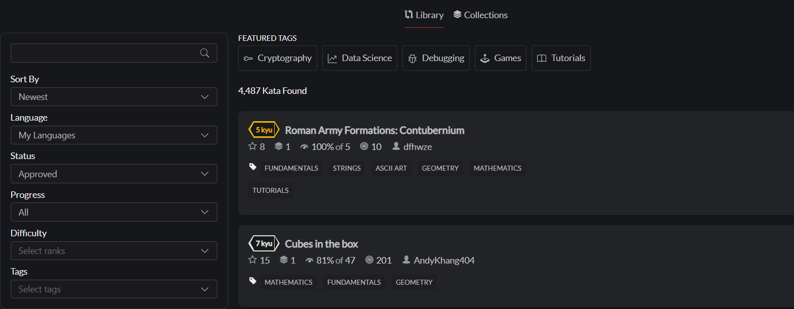

# Scrap kyu from Codewars



This project is a small console application showing the first 30 tasks according to the specified criteria. 

## Criteria:
+ Language
+ Difficulty

You can choose a difficulty from 1 to 8 (as in the original).
But the choice of languages is more sparse, to choose from:
+ C++
+ C#
+ C
+ Java
+ Javascript
+ Kotlin
+ Python
+ PHP

The rest of the languages will probably come later.

## Installing:

To install simply create a clone of the repository, the project uses the builder Maven.

#### But you need to add these dependencies:

```maven
    <dependency>
      <groupId>junit</groupId>
      <artifactId>junit</artifactId>
      <version>3.8.1</version>
      <scope>test</scope>
    </dependency>

    <dependency>
      <groupId>org.springframework</groupId>
      <artifactId>spring-core</artifactId>
      <version>6.0.4</version>
    </dependency>

    <dependency>
      <groupId>org.springframework</groupId>
      <artifactId>spring-beans</artifactId>
      <version>6.0.4</version>
    </dependency>

    <dependency>
      <groupId>org.springframework</groupId>
      <artifactId>spring-context</artifactId>
      <version>6.0.4</version>
    </dependency>

    <dependency>
      <groupId>javax.annotation</groupId>
      <artifactId>javax.annotation-api</artifactId>
      <version>1.3.2</version>
    </dependency>

    <dependency>
      <groupId>org.jsoup</groupId>
      <artifactId>jsoup</artifactId>
      <version>1.15.3</version>
    </dependency>
```

#### And reload project.

